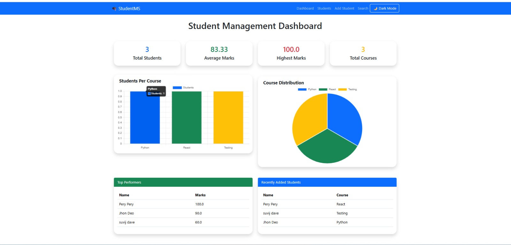
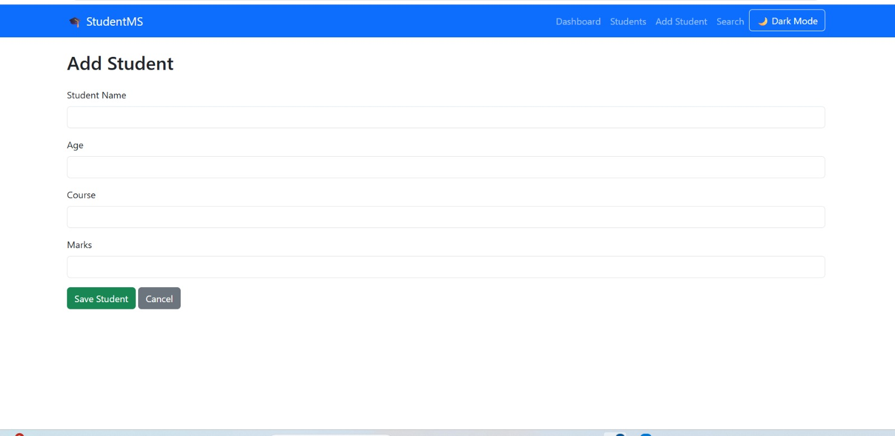
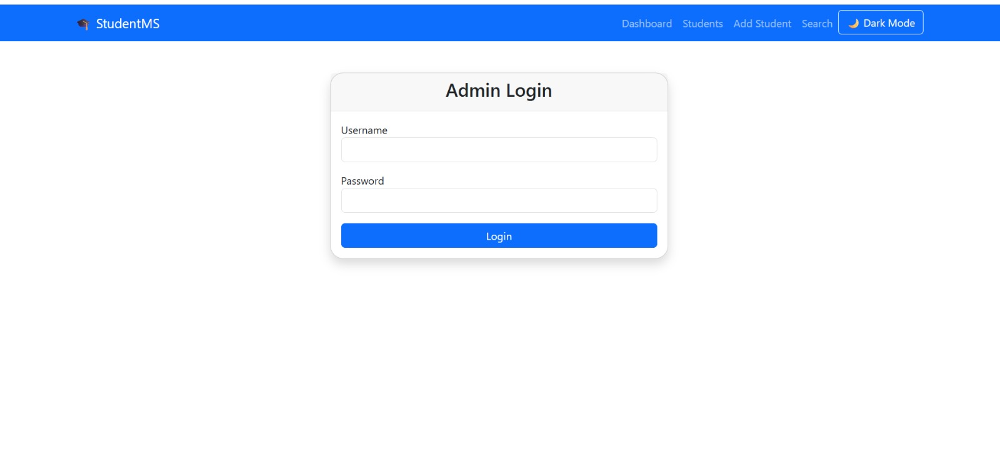

# 🎓 Student Management System

A modern **Student Management System** built with **Python, Flask, SQLite, Bootstrap 5, and Chart.js**. The application allows administrators to efficiently manage student records through a clean, responsive web interface.

---

## 📸 Screenshots

> Add screenshots after uploading your project to GitHub.

### Dashboard


### Students List


### Add Student


### Login


---

## ✨ Features

- 🔐 Admin Login Authentication
- 📊 Interactive Dashboard
- ➕ Add Student
- ✏️ Edit Student
- ❌ Delete Student
- 🔍 Search Students
- 🎯 Filter by Course
- 🔃 Sort by Name, Age, or Marks
- 📄 Pagination
- 📈 Dashboard Charts (Chart.js)
- 📤 Export Students to CSV
- 💬 Bootstrap Flash Messages
- 📱 Fully Responsive Design
- 💾 SQLite Database

---

## 🛠️ Tech Stack

| Technology | Purpose |
|------------|---------|
| Python | Programming Language |
| Flask | Web Framework |
| SQLite | Database |
| SQLAlchemy | ORM |
| Bootstrap 5 | UI Framework |
| Chart.js | Dashboard Charts |
| HTML5 | Structure |
| CSS3 | Styling |
| JavaScript | Client-side Functionality |

---

## 📂 Project Structure

```text
StudentManagementSystem/
│
├── static/
│   ├── css/
│   ├── js/
│   ├── images/
│   └── uploads/
│
├── templates/
│   ├── base.html
│   ├── dashboard.html
│   ├── students.html
│   ├── add_student.html
│   ├── edit_student.html
│   ├── login.html
│   └── search.html
│
├── models/
│   ├── student.py
│   └── admin.py
│
├── instance/
│   └── students.db
│
├── app.py
├── requirements.txt
└── README.md
```

---

## 🚀 Installation

### 1. Clone the Repository

```bash
git clone https://github.com/chaudhari203/StudentManagementSystem.git
```

### 2. Navigate to the Project

```bash
cd StudentManagementSystem
```

### 3. Create a Virtual Environment

```bash
python -m venv venv
```

### 4. Activate the Virtual Environment

#### Windows

```bash
venv\Scripts\activate
```

#### macOS/Linux

```bash
source venv/bin/activate
```

### 5. Install Dependencies

```bash
pip install -r requirements.txt
```

### 6. Run the Application

```bash
python app.py
```

Open your browser and visit:

```
http://127.0.0.1:5000
```

---

## 👤 Admin Login

Use the credentials you created in your application.

Example:

```
Username: admin
Password: ********
```

---

## 📊 Application Modules

- Dashboard
- Student Management
- Search Students
- Course Filter
- Sorting
- Pagination
- CSV Export
- Charts
- Authentication

---

## 📈 Future Enhancements

- 📄 PDF Report Export
- 🌙 Dark Mode
- 📧 Email Notifications
- 🔔 Toast Notifications
- ☁️ Cloud Deployment
- 👥 Multiple User Roles
- 📱 REST API

---

## 📚 Learning Outcomes

This project demonstrates knowledge of:

- Flask Routing
- SQLAlchemy ORM
- CRUD Operations
- Authentication
- SQLite Database
- Bootstrap 5
- Chart.js
- Responsive Web Design
- Flash Messages
- Pagination
- Search & Filtering
- File Export

---

## 🤝 Contributing

Contributions are welcome.

1. Fork the repository.
2. Create a new branch.
3. Commit your changes.
4. Push the branch.
5. Open a Pull Request.

---

## 📄 License

This project is developed for educational and portfolio purposes.

---

## 👩‍💻 Author

**Laxmi Chaudhari**

---

⭐ If you found this project helpful, consider giving it a star on GitHub.